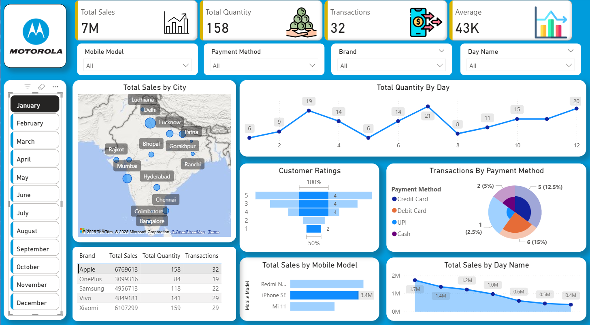

# MOBILE_PHONE_SALES_DATA_DASHBOARD

## Project Overview
This Power BI dashboard provides a comprehensive analysis of mobile sales data across various dimensions including cities, brands, models, and payment methods. It was developed as part of a hands-on learning experience with Skill Course, focusing on data modeling, DAX, and interactive visual storytelling.

## Key Insights
- Total Sales Overview:
Get a quick glance at overall performance metrics.

### City-wise Sales Distribution:
Visual mapping of mobile sales across different cities.

### Payment Method Breakdown:
Analyze sales through Credit Card, Debit Card, UPI, and Cash.

### Customer Ratings Analysis:
Insights into customer feedback and satisfaction.

### Sales Trends:
Day-wise trends and performance analysis by mobile model.

-This project demonstrates the use of Power BI for analyzing and visualizing mobile sales data. The dashboard offers clear insights into sales performance across multiple dimensions such as location, brand, model, payment method, and customer ratings.
